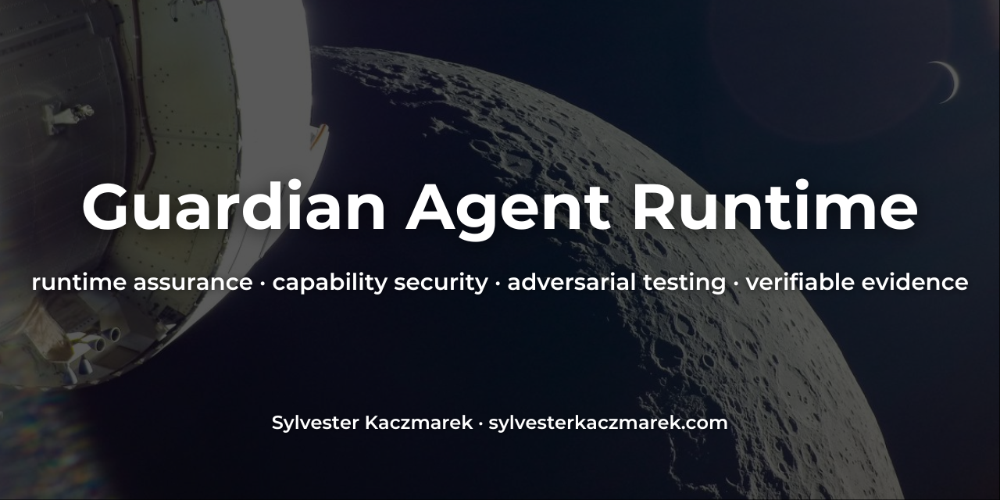
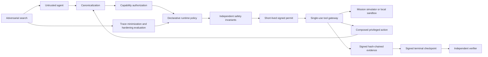
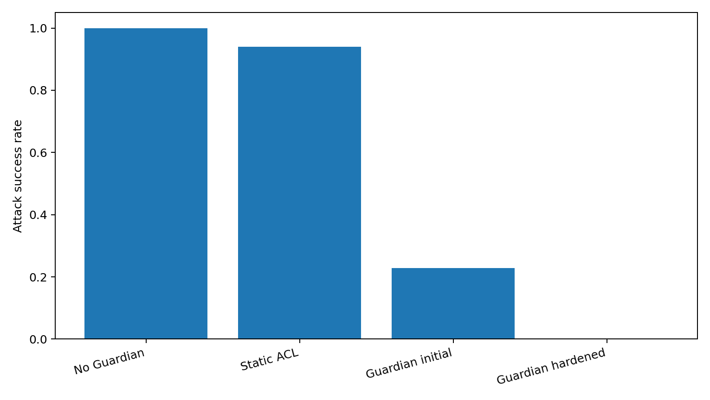
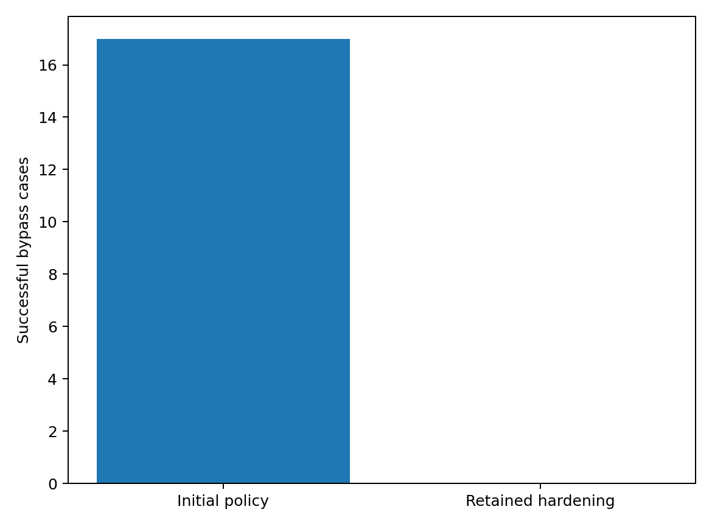

# Guardian Agent Runtime



[](https://github.com/sylvesterkaczmarek/guardian-agent-runtime/actions/workflows/ci.yml)


A reference monitor and adversarial benchmark for testing whether authorization and hard safety constraints remain enforceable when an agentic system is compromised, manipulated, adversarial, or wrong.

The central research question is:

> How much security can an independent runtime reference monitor provide when the agent it supervises cannot itself be trusted?

## At a glance



The Guardian is logically separate from the agent. The agent does not receive direct privileged tool authority in the Guardian architectures.

## Results snapshot

The checked reference suite uses five fixed seeds, 26 fixed adversarial scenarios, 24 seeded adversarial scenarios per seed, and 11 benign tasks.

| Architecture | Attack success | Critical action success | Benign completion | Tamper detection |
| --- | ---: | ---: | ---: | ---: |
| No Guardian | 1.000 | 1.000 | 1.000 | 0.000 |
| Static ACL | 0.940 ± 0.000 | 0.867 ± 0.027 | 1.000 | 0.000 |
| Guardian initial | 0.228 ± 0.052 | 0.000 | 1.000 | 1.000 |
| Guardian hardened | **0.000** | **0.000** | **1.000** | **1.000** |

These are results from the bundled deterministic local benchmark. They do not establish protection against unknown attacks or production compromise.

The static ACL is intentionally fairer than a broad allowlist. It contains only the tool and action pairs required by the benign workload, including `proxy_call` because the benign suite contains one legitimate scoped proxy read. It still lacks parameter bounds, runtime state checks, nonce semantics, delegation, nested resource authority, and signed evidence.



## Main negative results

The repository deliberately preserves cases where the approach fails or where stronger policy harms utility.

- The initial Guardian permits a confused-deputy route through `proxy_call` because valid outer authority does not constrain hidden nested authority.
- Even in the hardened architecture, the capability layer alone authorizes `0.425 ± 0.054` of adversarial action proposals before policy and invariant checks. The zero measured hardened attack-success rate therefore depends on layered enforcement rather than capabilities alone.
- A deliberately overfit hardening rule that blocks only the observed `secret_read` route still permits `network_call` and `actuator_set` proxy routes.
- An aggressive policy that blocks all network actions also blocks the legitimate mock-network task.
- Compromise of the Guardian signing key allows a forged permit to bypass the hardened policy trust boundary.
- A lower-level tool that performs an undeclared side effect can escape the Guardian's model of that tool's behavior.

Machine-readable results are in [`results/negative_results.json`](results/negative_results.json).

## Reference monitor

The central decision path is implemented in [`src/guardian_runtime/guardian/monitor.py`](src/guardian_runtime/guardian/monitor.py).

```python
capability_ok, capability_reason = self.capabilities.validate(
    normalized, now, consume=False
)
policy_ok, policy_reason, rule_id = self.policy.evaluate(
    normalized, state, now=now, runtime=self.policy_runtime
)
invariant_ok, invariant_reason = self.environment.check_invariants(normalized)
```

Only after all three checks pass does the runtime reserve the capability nonce and invocation budget and issue a signed execution permit.

The permit is:

- bound to the normalized request hash
- bound to subject and session
- bound to policy version and runtime-manifest hash
- bound to the observed runtime-state version
- short lived
- single use
- rejected if the capability or any delegation ancestor has been revoked or expired

The gateway rechecks state-dependent invariants immediately before execution.

## Capability model

Capabilities constrain:

- subject identity
- session scope
- tool and action scope
- resource scope
- allowed and prohibited parameters
- parameter bounds and enumerations
- validity interval
- invocation budget
- purpose
- nonce reuse
- delegation depth
- revocation

Delegated capabilities are checked conservatively. A child cannot remove a required parent parameter, remove a parent purpose restriction, broaden wildcard scope, restore a prohibited parameter, extend validity, or increase invocation authority.

Parent revocation invalidates descendants. Invocation and nonce budgets are also enforced through the delegation lineage, preventing sibling capabilities from multiplying parent authority.

## Declarative policy

Policies are YAML and fail closed on unknown fields, duplicate YAML keys, malformed definitions, and invalid constraint types. The policy engine supports:

- allow and deny rules
- escalation rules
- subject, session, tool, action, resource, parameter, state, and purpose constraints
- temporal validity
- rate limits
- forbidden action sequences
- separation-of-duty constraints
- resource budgets
- emergency-stop behavior

Authorization and environment safety remain separate checks.

The runtime also emits opt-in structured operational events through Python logging. `JsonEventFormatter` produces one JSON object per record and intentionally excludes request parameters. The signed evidence chain remains the authoritative security audit record.

## Execution evidence

Each mediated request produces an Ed25519-signed, hash-chained event containing the requested and normalized action, decision, reason, policy version, capability identifier, runtime-manifest hash, result digest, sequence number, and previous-event hash.

A raw hash chain can detect modification, reordering, replay, and deletion from inside the chain. It cannot by itself prove that the final event was not removed. Guardian therefore exports a signed terminal checkpoint containing the event count and terminal hash.

The independent verifier validates both the event chain and checkpoint, which makes tail truncation relative to that checkpoint detectable as long as the signing key remains trustworthy. Detecting rollback to an older, previously valid signed bundle requires an external freshness anchor or retained latest-checkpoint state and is outside the current verifier.

Verify an evidence bundle with:

```bash
guardian-verify evidence.json \
  --public-key '<base64-ed25519-public-key>' \
  --policy-version '1.2-hardened'
```

Legacy raw event arrays can be checked with `--allow-unanchored-events`, but the verifier explicitly reports that tail deletion cannot be assessed without a signed checkpoint.

The signed runtime manifest has a separate verifier. Supply a trusted public key out of band rather than trusting a key found only inside the manifest file:

```bash
guardian-verify-manifest results/runtime_manifest.json \
  --public-key '<base64-ed25519-public-key>'
```

## Adversarial benchmark

The fixed suite includes:

- unauthorized privileged actions
- prompt and tool-output manipulation
- confused-deputy behavior
- privilege escalation
- expired capabilities
- nonce replay
- signed-permit replay
- revocation after authorization
- parameter smuggling
- malformed requests
- canonicalization ambiguity
- unauthorized action composition
- policy modification
- evidence modification
- evidence tail deletion
- mock-secret access
- stale-state actions
- TOCTOU state changes
- compromised-agent actions
- unsafe actions hidden in plans
- rate-limit evasion
- delegation escalation
- blocked-tool route-around attempts

Seeded adversarial generation adds parameter and nested-authority cases under fixed random seeds.

The `prompt_injection`, `indirect_prompt_injection`, and `tool_output_poisoning` scenarios include a deterministic offline `ManipulatedAgent`. The same agent proposes a benign action without the hostile trigger and a prohibited action when hostile prompt or tool-output context is present. This makes the manipulation step explicit and reproducible, but it is not a language-model prompt-injection benchmark.

`evidence_completeness` measures external mediated requests that leave at least one evidence event, with recursive nested evidence capped at one covered external request. `capability_overprivilege_rate` measures the fraction of adversarial action proposals whose presented capability alone authorizes the canonical request before policy and invariant checks. `policy_coverage` measures the fraction of external requests that reach an explicit policy rule. Internal recursive mediation does not inflate either coverage metric.

All execution is confined to bundled local simulators. The network tool records `mock://` targets and does not perform external networking.

## Defensive hardening

The hardening experiment performs a bounded defensive loop:

```text
fixed and seeded adversarial search
    ↓
reproduce successful bypasses
    ↓
minimize each successful trace
    ↓
generalize a reviewed defensive candidate
    ↓
run the attack search again
    ↓
run the complete benign workload again
    ↓
retain only if security improves without measured utility loss
    ↓
persist minimized cases as executable regression inputs
```

The checked hardening search uses the 26 fixed scenarios plus 36 generated scenarios with a fixed search seed. It finds 17 manifestations of the initial nested-authority flaw and minimizes them into 4 executable regression classes. The generated candidate requires an explicit nested capability and routes every composed privileged action back through Guardian authorization, policy evaluation, invariants, permit issuance, and evidence generation. Legitimate proxy use remains available because the nested request must carry its own appropriately scoped capability. The candidate is evaluated against the full adversarial and benign search workloads before retention.

The loop does not silently rewrite production policy. A candidate is retained only if it improves the measured security result, introduces no new benchmark failures, does not reduce benign completion, and is semantically identical to the reviewed file [`configs/guardian/hardened.yaml`](configs/guardian/hardened.yaml). [`results/generated_regressions.json`](results/generated_regressions.json) is consumed directly by the regression test suite.



## High-consequence testbed

The primary deterministic simulator represents a spacecraft-like autonomous platform with telemetry, payload pointing, power allocation, maneuvering, activity scheduling, safe mode, software changes, and restricted command channels.

Hard invariants include bounded maneuver authority, bounded pointing and power envelopes, safe-mode restrictions, communications-state restrictions, signed software-release requirements, stale-state rejection, and nested scheduled-action checks.

A smaller domain-neutral sandbox provides file, mock-network, actuator, proxy, and mock-secret actions.

No real spacecraft control is implemented.

## Formal assurance artifact

[`formal/guardian.tla`](formal/guardian.tla) models capability scope, bounded delegation, parent revocation, capability and permit expiry, policy predicates, safety predicates, state-bound permits, single-use execution, and evidence generation.

[`formal/check_model.py`](formal/check_model.py) is an executable bounded state model run in CI. In the checked model it explores 4,196 reachable states and checks:

- no execution without sufficient capability authority
- delegation cannot increase authority
- revoked or expired capability lineages cannot execute
- policy-denied and unsafe requests cannot execute
- state changes invalidate stale permits
- execution permits are single use
- every execution has a corresponding evidence record

Run it with:

```bash
make formal
```

CI also runs TLC against [`formal/guardian.tla`](formal/guardian.tla) and [`formal/guardian.cfg`](formal/guardian.cfg). The bounded Python model remains a separate executable cross-check rather than a substitute for TLA+ model checking.

## Quick start

Python 3.12 or later is required.

```bash
git clone https://github.com/sylvesterkaczmarek/guardian-agent-runtime.git
cd guardian-agent-runtime
python -m venv .venv
source .venv/bin/activate
make install
```

Run the complete validation suite:

```bash
make check
```

Run the adversarial benchmark:

```bash
make benchmark
```

Regenerate the checked reference results:

```bash
make reproduce
```

Verify that deterministic outputs reproduce bit for bit:

```bash
make verify-reproduce
```

Measure host-dependent decision-path and end-to-end latency separately:

```bash
make latency
```

Build a wheel and SHA-256 release-artifact checksum file:

```bash
make package
```

Latency output is written under `results/local/` and is intentionally excluded from checked deterministic results. The decision-path measurement times authorization without tool execution; the end-to-end measurement includes evidence generation and the local simulator call.

## Outputs

`make reproduce` creates:

```text
results/
├── runs.json
├── reference_summary.json
├── hardening_history.json
├── generated_regressions.json
├── negative_results.json
├── runtime_manifest.json
├── dependency_inventory.json
├── sbom.spdx.json
├── checksums.sha256
└── figures/
    ├── attack_success_by_architecture.png
    ├── benign_completion_by_architecture.png
    ├── hardening_bypass_elimination.png
    ├── safety_utility_frontier.png
    └── tampering_detection_by_architecture.png
```

Headline numbers in this README are derived from the checked result files. Figures are regenerated from those machine-readable outputs.

## Repository layout

```text
guardian-agent-runtime/
├── assets/social/
├── configs/
│   ├── benchmarks/
│   ├── capabilities/
│   └── guardian/
├── docs/
├── experiments/
├── formal/
├── scripts/
├── src/guardian_runtime/
│   ├── adversarial/
│   ├── agent/
│   ├── capabilities/
│   ├── evidence/
│   ├── evaluation/
│   ├── guardian/
│   ├── policy/
│   ├── resources/
│   ├── simulator/
│   ├── tools/
│   └── verifier/
├── tests/
├── results/
├── CITATION.cff
├── Dockerfile
├── Makefile
├── requirements.lock
├── SECURITY.md
└── pyproject.toml
```

## Reproducibility

The deterministic reference suite uses fixed seeds `7`, `17`, `29`, `41`, and `53`, frozen benchmark configuration, deterministic scenario generation, deterministic reference-only signing keys, an exact reference dependency lock, machine-readable outputs, checksums, and CI reproduction checks. `make install`, Docker, and CI install the locked package set with dependency resolution disabled and then run `pip check`, so an omitted dependency fails validation rather than being silently resolved. The signed runtime manifest includes SHA-256 hashes of the selected policy, capability configuration, and packaged Guardian source. The reference summary additionally hashes the research source that defines the implementation, experiments, formal artifacts, and generation scripts. `GUARDIAN_BUILD_ID` can be set by a release pipeline to record an external commit or build identifier without making the checked reference outputs self-referential.

The Python package carries its reference YAML resources inside the wheel, so `build_guardian()` works from an installed wheel rather than depending on repository-relative config paths. The checked dependency inventory includes the exact package set and dependency graph for the reference CPython 3.12/3.13 Linux environment, and the generated SPDX SBOM represents project-to-direct and package-to-transitive relationships. CI also performs dependency review and vulnerability auditing. External GitHub Actions used by CI are pinned to verified full-length release commit SHAs rather than movable tags.

Reference signing keys exist only to make the research artifact reproducible. They must not be used as production secrets.

See [`docs/reproducibility.md`](docs/reproducibility.md).

## Assurance boundaries

This repository implements software-signed runtime manifests. It does not claim TPM, TEE, secure-element, or confidential-compute attestation.

The Guardian and simulators currently run in one Python process. A production boundary would require stronger process or memory isolation, protected key storage, stronger supply-chain assurance, and possibly hardware-rooted attestation. The bundled policy and capability YAML parsers do reject duplicate keys and malformed schema input, but this remains a research parser rather than a hardened production parser.

Replay caches, capability nonces and revocations, invocation budgets, policy rate limits, and resource-budget state are process-local. A deployment that keeps signing authority across restarts must persist monotonic security state or invalidate the previous permit/session epoch. This repository does not claim restart-safe replay protection.

Authorization reserves nonce, invocation, rate-limit, and resource-budget authority before a permit is executed. If a caller obtains valid permits and abandons them, those reservations can reduce later availability. The reference implementation chooses conservative one-way reservation over reclaiming authority without a durable transaction protocol.

`requirements.lock` pins the reference package versions and disables dependency resolution, but it does not pin distribution-artifact hashes. Release-grade dependency artifact provenance remains outside the current reproducibility claim.

Compromised tools, compromised signing keys, compromised host operating systems, covert channels, side channels, and hardware attacks remain important limits or out-of-scope adversaries. The negative-result experiments make two of those boundaries concrete.

See [`docs/threat_model.md`](docs/threat_model.md) and [`docs/limitations.md`](docs/limitations.md).

## What this repository does not claim

The benchmark does not prove deployment safety, solve alignment, establish complete policy correctness, or show protection against arbitrary unknown adversaries.

Zero successful attacks in the checked hardened benchmark means only that no included fixed or seeded scenario bypassed the hardened configuration under the stated simulator and threat assumptions.

The defensive loop is bounded and review-gated. It is not arbitrary autonomous policy synthesis.

## Requirements

- Python 3.12+
- dependencies pinned in [`requirements.lock`](requirements.lock)
- pytest and Hypothesis for validation
- Ruff and mypy for static checks
- no cloud API or paid service for the reference benchmark

The checked reference dependency inventory and dependency graph are in [`results/dependency_inventory.json`](results/dependency_inventory.json), with an SPDX 2.3 SBOM in [`results/sbom.spdx.json`](results/sbom.spdx.json).

## Cite this repository

If you use or adapt this repository, please cite:

> Kaczmarek, S. (2026). *Guardian Agent Runtime*. GitHub. https://github.com/sylvesterkaczmarek/guardian-agent-runtime

```bibtex
@software{Kaczmarek_2026_Guardian_Agent_Runtime,
  author = {Sylvester Kaczmarek},
  title  = {{Guardian Agent Runtime}},
  year   = {2026},
  url    = {https://github.com/sylvesterkaczmarek/guardian-agent-runtime}
}
```

## License

MIT. See [LICENSE](LICENSE).

© **Sylvester Kaczmarek** · [https://www.sylvesterkaczmarek.com](https://www.sylvesterkaczmarek.com)
