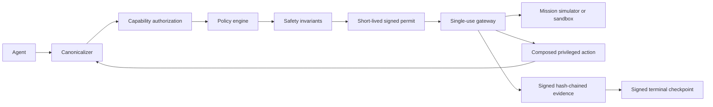

# Architecture

Guardian Agent Runtime treats the agent, natural-language context, and tool output as untrusted. Privileged actions pass through a reference monitor before they reach a tool.

Capability authorization and policy evaluation are distinct. Capability checks answer whether the requester holds the required authority. Policy and invariant checks answer whether that authorized action is acceptable in the current deployment and state.

Permits are bound to request hash, subject, session, capability, policy version, runtime-manifest hash, state version, issue time, expiry, and sequence number. The gateway verifies the signature, current capability status, permit freshness, single-use status, state version, and safety invariants before crossing the privileged boundary.

Delegation is transitive. Revoking an ancestor invalidates descendants, and invocation and nonce budgets are charged through the lineage.

In the hardened sandbox path, `proxy_call` cannot borrow the outer capability to exercise nested authority. The outer request names an explicit nested capability, and the gateway sends the nested `ActionRequest` back through the Guardian. The nested action receives its own authorization decision, permit, gateway execution, and evidence event. The deliberately incomplete initial architecture retains direct lower-level proxy dispatch as the before-hardening comparison.

Gateway execution triggers evidence generation even when a caller invokes the gateway directly with a valid permit. Modeled tool exceptions are converted to failed tool results and evidenced after the privileged boundary is crossed. Denied requests submitted through `execute_request` are also recorded.

The current implementation is a research reference monitor in one Python process. It demonstrates authority semantics, state binding, evidence integrity, attack evaluation, and review-gated hardening. It does not provide process, kernel, or hardware isolation.
